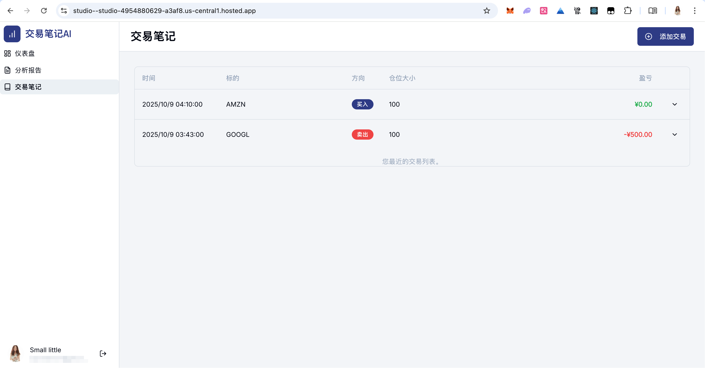
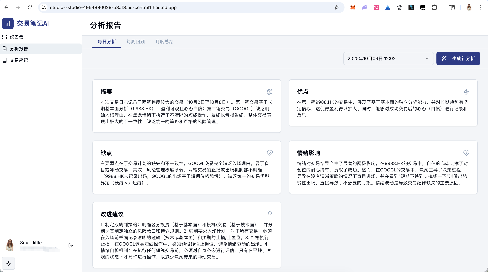
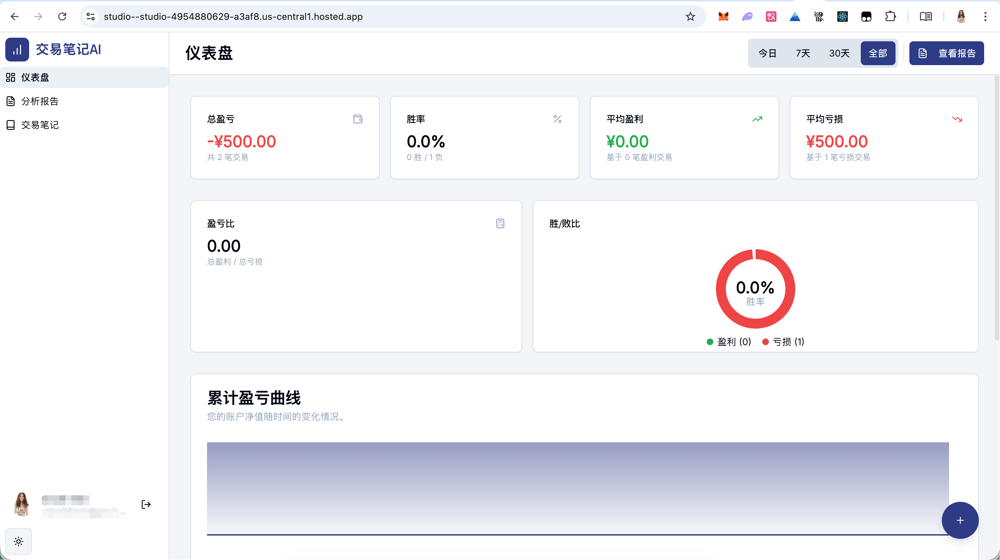

# 交易笔记AI (Trade Journal AI)

**English** | [**简体中文**](./README.zh-CN.md)

---

**交易笔记AI** 是一款专为交易者设计的现代化、由AI驱动的交易日志分析工具。它旨在帮助您记录、分析并从每一笔交易中学习，通过深度数据洞察和智能建议，最终提升您的交易表现。

[](https://studio--studio-4954880629-a3af8.us-central1.hosted.app/)

## ✨ 核心功能

- **📝 现代化交易日志**: 快速、便捷地记录您的每一笔交易，包括入场/出场理由、仓位大小、盈亏、交易心态等关键信息。
- **📊 可视化仪表盘**: 通过直观的图表和关键绩效指标（KPIs）全面了解您的交易表现，包括累计盈亏曲线、胜率、盈亏比、平均盈利/亏损等。
- **🤖 AI驱动的深度分析**:
    - **每日分析**: AI每日总结您的交易活动，识别优点与不足，并分析情绪对决策的影响。
    - **每周回顾**: 发现您交易行为中的成功模式和常见错误，并评估仓位管理的有效性。
    - **月度总结**: 对比今、昨两月的表现，识别长期存在的问题，并提供系统性的迭代建议。
- **🔐 数据私有化与安全**: 所有数据都安全地存储在您自己的 Firebase 项目中，确保您的交易隐私和数据所有权。
- **🎨 现代、美观且响应式**: 采用 `shadcn/ui` 和 `Tailwind CSS` 构建，确保在桌面和移动设备上都有一流的用户体验。

| 交易日志 | AI分析报告 |
| :---: | :---: |
|  |  |

## 🚀 技术栈

- **框架**: [Next.js](https://nextjs.org/) (App Router)
- **后端 & 数据库**: [Firebase](https://firebase.google.com/) (Authentication), PostgreSQL
- **AI**: [Google AI (Gemini)](https://ai.google.dev/) via [Genkit](https://firebase.google.com/docs/genkit)
- **UI**: [React](https://react.dev/), [TypeScript](https://www.typescriptlang.org/), [shadcn/ui](https://ui.shadcn.com/), [Tailwind CSS](https://tailwindcss.com/)
- **图表**: [Recharts](https://recharts.org/)

## 🛠️ 私有化部署指南

您可以轻松地将此项目部署到您自己的环境中。

### 前提条件

1.  **Node.js**: 版本 >= 18.0.0
2.  **Firebase Account**: [创建一个Firebase账户](https://firebase.google.com/)
3.  **Google AI API Key**: [获取一个Google AI API 密钥](https://ai.google.dev/)

### 步骤 1: 克隆仓库

```bash
git clone https://github.com/SaudM/Trade-Insight-AI.git
cd Trade-Insight-AI
```

### 步骤 2: 安装依赖

```bash
npm install
```

### 步骤 3: 配置 Firebase

1.  访问 [Firebase 控制台](https://console.firebase.google.com/) 并创建一个新的 Firebase 项目。
2.  在项目设置中，添加一个新的“Web 应用”。
3.  复制生成的 Firebase 配置对象，并用它替换 `src/firebase/config.ts` 文件中的内容。
4.  在 Firebase 控制台中，进入 **Authentication** > **Sign-in method**，并启用“邮箱/密码”和“Google”登录提供商。
5.  配置PostgreSQL数据库连接（参见环境变量配置）。

### 步骤 4: 配置环境变量

在项目根目录下创建一个名为 `.env.local` 的文件，并添加您的 Google AI API 密钥：

```
GEMINI_API_KEY=YOUR_GOOGLE_AI_API_KEY
```

### 步骤 5: 运行开发服务器

```bash
npm run dev
```

现在，您应该可以在 `http://localhost:9002` 访问您的应用了。

### 步骤 6: 部署 (可选)

您可以将此应用轻松部署到 [Vercel](https://vercel.com/) 或 [Firebase App Hosting](https://firebase.google.com/docs/hosting)。

#### 部署到 Vercel

1.  将您的项目推送到 GitHub。
2.  在 Vercel 上，导入您的 GitHub 仓库。
3.  在环境变量设置中，添加 `GEMINI_API_KEY`。
4.  点击部署！

## 📄 许可协议

本项目采用 **商业源代码许可 (Business Source License 1.1)**。

- **非商业用途**: 您可以自由地使用、复制、修改和分发本软件，但仅限于非商业目的。
- **商业用途**: 任何将本软件用于商业产品或服务的行为，都必须获得我们的商业许可。

**简而言之**:
- 🟢 **允许**: 个人学习、研究、运行在您自己的服务器上用于个人交易分析。
- 🔴 **禁止**: 在未获得商业许可的情况下，将本软件作为付费产品（SaaS）提供给他人，或将其集成到您的商业产品中。

在 **3 年** 后，本项目的许可将自动转换为对商业使用更友好的 **Apache License 2.0**。

如果您对商业许可感兴趣，请联系我们。

---
*This README was co-authored by AI.*
