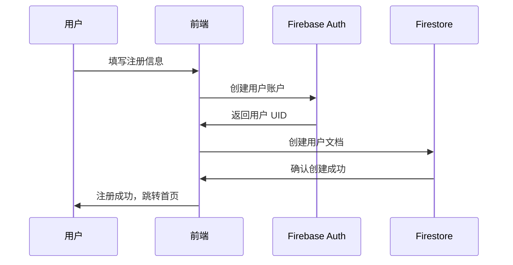
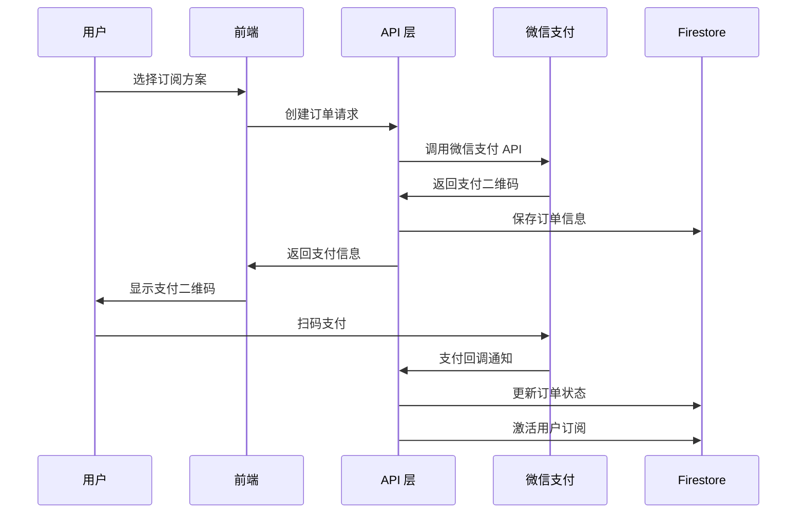
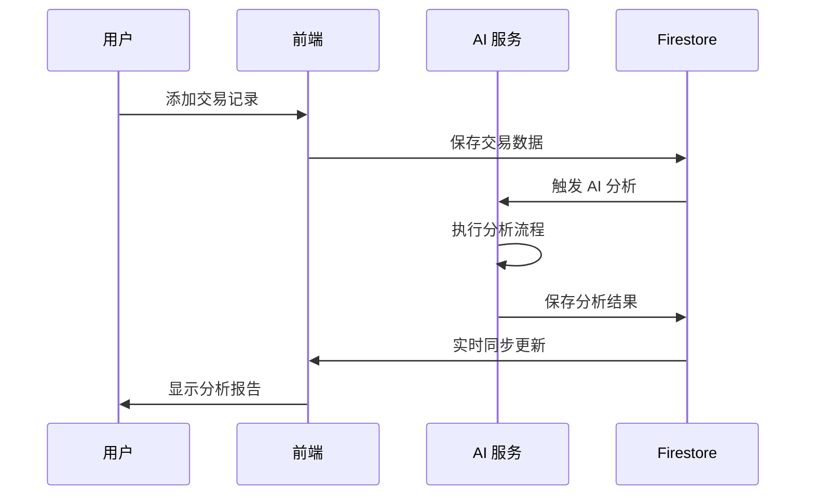
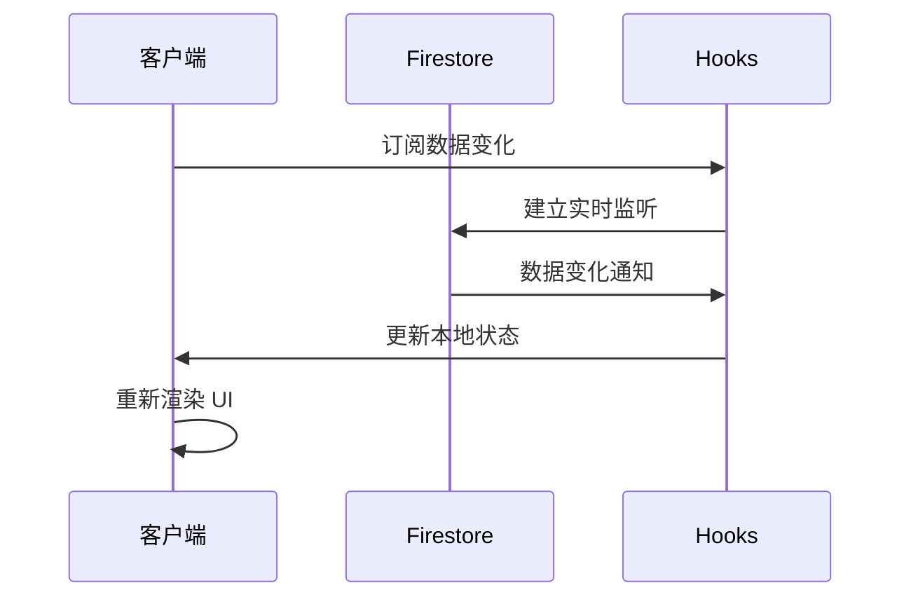

# Trade Insight AI - 技术架构文档

## 目录
1. [系统概述](#系统概述)
2. [系统架构](#系统架构)
3. [技术栈](#技术栈)
4. [模块功能描述](#模块功能描述)
5. [数据库设计](#数据库设计)
6. [API 接口设计](#api-接口设计)
7. [AI 服务架构](#ai-服务架构)
8. [部署环境](#部署环境)
9. [关键业务流程](#关键业务流程)
10. [维护注意事项](#维护注意事项)

---

## 系统概述

**Trade Insight AI** 是一个基于人工智能的交易笔记管理平台，旨在帮助交易者记录、分析和改进他们的交易策略。系统采用现代化的全栈架构，集成了 AI 分析、实时数据同步、支付处理和用户管理等核心功能。

### 核心特性
- 🤖 **AI 驱动分析**: 基于 Google Genkit 的智能交易分析
- 📊 **实时数据同步**: Firebase Firestore 实时数据库
- 💳 **订阅管理**: 集成微信支付的订阅服务
- 🔐 **安全认证**: Firebase Authentication 用户管理
- 📱 **响应式设计**: 支持多设备访问
- 🌙 **主题切换**: 支持明暗主题模式

---

## 系统架构

系统采用分层架构设计，主要包含以下层次：

### 1. 前端层 (Frontend Layer)
- **框架**: Next.js 15.3.3 (React 18.3.1)
- **样式**: Tailwind CSS + Radix UI
- **状态管理**: React Hook Form + Context API
- **类型安全**: TypeScript 5

### 2. API 层 (API Layer)
- **路由**: Next.js API Routes
- **认证**: Firebase Auth 集成
- **支付**: 微信支付 V3 API
- **AI 服务**: Google Genkit 集成

### 3. 数据层 (Data Layer)
- **数据库**: Cloud Firestore
- **实时同步**: Firebase SDK
- **缓存**: Firebase 本地缓存
- **安全规则**: Firestore Security Rules

### 4. AI 处理层 (AI Processing Layer)
- **AI 引擎**: Google Genkit
- **分析流程**: 自定义 AI Flows
- **报告生成**: 智能内容生成

---

## 技术栈

### 前端技术栈
| 技术 | 版本 | 用途 |
|------|------|------|
| Next.js | 15.3.3 | React 全栈框架 |
| React | 18.3.1 | 用户界面库 |
| TypeScript | 5.x | 类型安全 |
| Tailwind CSS | 3.4.1 | CSS 框架 |
| Radix UI | 各组件最新版 | 无障碍 UI 组件 |
| React Hook Form | 7.54.2 | 表单管理 |
| Zod | 3.24.2 | 数据验证 |
| Recharts | 2.15.1 | 图表组件 |
| Lucide React | 0.475.0 | 图标库 |

### 后端技术栈
| 技术 | 版本 | 用途 |
|------|------|------|
| Firebase | 11.9.1 | 后端即服务 |
| Firebase Admin | 13.5.0 | 服务端 SDK |
| Google Genkit | 1.20.0 | AI 服务框架 |
| Axios | 1.7.2 | HTTP 客户端 |
| wxpay-v3 | 3.0.2 | 微信支付 SDK |

### 开发工具
| 工具 | 版本 | 用途 |
|------|------|------|
| Node.js | 20+ | 运行环境 |
| npm | 最新 | 包管理器 |
| ESLint | 内置 | 代码检查 |
| PostCSS | 8.x | CSS 处理 |

---

## 模块功能描述

### 1. 用户认证模块 (`src/firebase/`)
**功能**: 处理用户注册、登录、会话管理
- **文件结构**:
  - `config.ts` - Firebase 配置
  - `provider.tsx` - Firebase 上下文提供者
  - `client-provider.tsx` - 客户端提供者
  - `non-blocking-login.tsx` - 非阻塞登录组件
  - `error-emitter.ts` - 错误事件发射器

**核心功能**:
- 用户注册和登录
- 会话状态管理
- 权限验证
- 错误处理和重试机制

### 2. 数据访问模块 (`src/firebase/firestore/`)
**功能**: 封装 Firestore 数据操作
- **核心 Hooks**:
  - `useCollection` - 集合数据订阅
  - `useDoc` - 文档数据订阅
  - 实时数据同步
  - 权限错误处理

### 3. UI 组件模块 (`src/components/`)
**功能**: 可复用的 UI 组件
- **应用组件** (`app/`):
  - 业务相关组件
  - 页面级组件
  - 布局组件
- **基础组件** (`ui/`):
  - Radix UI 封装
  - 通用 UI 组件
  - 主题相关组件

### 4. 页面模块 (`src/app/`)
**功能**: 应用页面和路由
- **主要页面**:
  - `/` - 首页
  - `/login` - 登录页
  - `/signup` - 注册页
  - `/profile` - 个人中心
  - `/pricing` - 订阅方案
  - `/forgot-password` - 密码重置

### 5. API 模块 (`src/app/api/`)
**功能**: 服务端 API 接口
- **订单管理** (`orders/`):
  - 订单创建和查询
  - 支付状态更新
- **订阅服务** (`subscription/`):
  - 订阅创建 (`create/`)
  - 支付通知 (`notify/`)
  - 状态查询 (`status/`)

### 6. AI 服务模块 (`src/ai/`)
**功能**: AI 分析和报告生成
- **核心文件**:
  - `genkit.ts` - Genkit 配置
  - `dev.ts` - 开发环境配置
- **AI 流程** (`flows/`):
  - `daily-ai-analysis.ts` - 日常交易分析
  - `weekly-pattern-discovery.ts` - 周期模式发现
  - `weekly-improvement-plan.ts` - 周改进计划
  - `monthly-performance-review.ts` - 月度绩效评估
  - `system-iteration-suggestions.ts` - 系统迭代建议
  - `wechat-pay.ts` - 微信支付流程

### 7. 业务逻辑模块 (`src/lib/`)
**功能**: 核心业务逻辑和工具函数
- **核心文件**:
  - `types.ts` - TypeScript 类型定义
  - `utils.ts` - 通用工具函数
  - `data.ts` - 数据处理逻辑
  - `orders.ts` - 订单业务逻辑
  - `subscription.ts` - 订阅业务逻辑
  - `wxpay.ts` - 微信支付集成
  - `firebase-admin.ts` - Firebase Admin 配置
  - `orders-admin.ts` - 订单管理后台

---

## 数据库设计

### Firestore 数据结构

系统采用用户隔离的数据结构设计，所有数据都嵌套在用户文档下：

```
/users/{userId}
├── id: string                    // 用户 ID
├── email: string                 // 用户邮箱
├── displayName: string           // 显示名称
├── createdAt: timestamp          // 创建时间
├── updatedAt: timestamp          // 更新时间
│
├── /tradeLogs/{tradeLogId}       // 交易日志
│   ├── id: string
│   ├── date: timestamp
│   ├── symbol: string
│   ├── action: 'buy' | 'sell'
│   ├── quantity: number
│   ├── price: number
│   ├── notes: string
│   └── createdAt: timestamp
│
├── /dailyAnalyses/{analysisId}   // 日分析报告
│   ├── id: string
│   ├── date: timestamp
│   ├── analysis: string
│   ├── insights: string[]
│   ├── recommendations: string[]
│   └── createdAt: timestamp
│
├── /weeklyReviews/{reviewId}     // 周报告
│   ├── id: string
│   ├── weekStart: timestamp
│   ├── weekEnd: timestamp
│   ├── summary: string
│   ├── patterns: string[]
│   ├── performance: object
│   └── createdAt: timestamp
│   │
│   └── /weeklyImprovementPlan    // 周改进计划
│       ├── goals: string[]
│       ├── strategies: string[]
│       └── timeline: string
│
├── /monthlySummaries/{summaryId} // 月度总结
│   ├── id: string
│   ├── month: string
│   ├── year: number
│   ├── totalTrades: number
│   ├── profitLoss: number
│   ├── winRate: number
│   ├── insights: string[]
│   └── createdAt: timestamp
│
├── /orders/{orderId}             // 订单数据
│   ├── id: string
│   ├── amount: number
│   ├── currency: string
│   ├── status: string
│   ├── paymentMethod: string
│   ├── createdAt: timestamp
│   └── updatedAt: timestamp
│
└── /subscription/current         // 当前订阅
    ├── planId: string
    ├── status: 'active' | 'inactive' | 'expired'
    ├── startDate: timestamp
    ├── endDate: timestamp
    ├── autoRenew: boolean
    └── updatedAt: timestamp
```

### 安全规则设计

Firestore 安全规则确保数据隔离和访问控制：

```javascript
// 核心安全函数
function isSignedIn() {
  return request.auth != null;
}

function isOwner(userId) {
  return isSignedIn() && request.auth.uid == userId;
}

function isExistingOwner(userId) {
  return isOwner(userId) && resource != null;
}

// 用户数据规则
match /users/{userId} {
  allow get: if isOwner(userId);
  allow list: if false;  // 禁止列举用户
  allow create: if isOwner(userId) && request.resource.data.id == userId;
  allow update: if isExistingOwner(userId);
  allow delete: if isExistingOwner(userId);
}
```

---

## API 接口设计

### 1. 订单管理 API

**端点**: `/api/orders`

**方法**: `POST`
```typescript
// 请求体
interface CreateOrderRequest {
  amount: number;
  currency: string;
  planId: string;
}

// 响应体
interface CreateOrderResponse {
  orderId: string;
  paymentUrl: string;
  qrCode: string;
  status: string;
}
```

### 2. 订阅管理 API

**创建订阅**: `/api/subscription/create`
```typescript
interface CreateSubscriptionRequest {
  planId: string;
  paymentMethod: 'wechat' | 'alipay';
}
```

**支付通知**: `/api/subscription/notify`
```typescript
interface PaymentNotification {
  orderId: string;
  status: 'success' | 'failed';
  transactionId: string;
  timestamp: string;
}
```

**状态查询**: `/api/subscription/status`
```typescript
interface SubscriptionStatus {
  isActive: boolean;
  planId: string;
  expiresAt: string;
  autoRenew: boolean;
}
```

---

## AI 服务架构

### Google Genkit 集成

系统使用 Google Genkit 作为 AI 服务框架，提供以下功能：

#### 1. AI 分析流程 (AI Flows)

**日常交易分析** (`daily-ai-analysis.ts`)
```typescript
/**
 * 分析用户的日常交易数据
 * 输入: 交易日志数据
 * 输出: 分析报告和建议
 */
export const dailyAnalysisFlow = defineFlow({
  name: 'dailyAnalysis',
  inputSchema: z.object({
    trades: z.array(tradeSchema),
    date: z.string()
  }),
  outputSchema: z.object({
    analysis: z.string(),
    insights: z.array(z.string()),
    recommendations: z.array(z.string())
  })
});
```

**周期模式发现** (`weekly-pattern-discovery.ts`)
```typescript
/**
 * 发现用户交易的周期性模式
 * 输入: 一周的交易数据
 * 输出: 模式分析和趋势预测
 */
export const weeklyPatternFlow = defineFlow({
  name: 'weeklyPattern',
  inputSchema: weeklyDataSchema,
  outputSchema: patternAnalysisSchema
});
```

#### 2. AI 模型配置

```typescript
// src/ai/genkit.ts
import { configureGenkit } from '@genkit-ai/core';
import { googleGenAI } from '@genkit-ai/google-genai';

export const ai = configureGenkit({
  plugins: [
    googleGenAI({
      apiKey: process.env.GOOGLE_GENAI_API_KEY,
      models: ['gemini-1.5-flash', 'gemini-1.5-pro']
    })
  ],
  logLevel: 'debug',
  enableTracingAndMetrics: true
});
```

#### 3. 开发环境配置

```typescript
// src/ai/dev.ts
import { startFlowsServer } from '@genkit-ai/flow';
import './genkit'; // 导入配置

startFlowsServer({
  port: 3400,
  cors: {
    origin: true,
    credentials: true
  }
});
```

---

## 部署环境

### 开发环境

**要求**:
- Node.js 20+
- npm 或 yarn
- Firebase CLI
- Google Cloud CLI (可选)

**启动命令**:
```bash
# 安装依赖
npm install

# 启动开发服务器
npm run dev

# 启动 AI 服务 (开发模式)
npm run genkit:dev

# 启动 AI 服务 (监听模式)
npm run genkit:watch
```

**环境变量**:
```env
# Firebase 配置
NEXT_PUBLIC_FIREBASE_API_KEY=your_api_key
NEXT_PUBLIC_FIREBASE_AUTH_DOMAIN=your_domain
NEXT_PUBLIC_FIREBASE_PROJECT_ID=your_project_id

# Google AI 配置
GOOGLE_GENAI_API_KEY=your_genai_key

# 微信支付配置
WECHAT_PAY_APP_ID=your_app_id
WECHAT_PAY_MCH_ID=your_mch_id
WECHAT_PAY_PRIVATE_KEY=your_private_key
```

### 生产环境

**部署平台**: Firebase Hosting + Cloud Functions

**构建命令**:
```bash
# 类型检查
npm run typecheck

# 构建生产版本
npm run build

# 启动生产服务器
npm run start
```

**部署配置** (`apphosting.yaml`):
```yaml
runConfig:
  cpu: 1
  memoryMiB: 512
  minInstances: 0
  maxInstances: 10
  concurrency: 100
```

### 依赖管理

**核心依赖**:
- 生产依赖: 47 个包
- 开发依赖: 8 个包
- 总包大小: ~500MB (node_modules)

**关键补丁**:
- `wechatpay-node-v3+2.1.2.patch` - 微信支付 SDK 补丁

---

## 关键业务流程

### 1. 用户注册流程



### 2. 订阅购买流程



### 3. AI 分析流程



### 4. 数据同步流程



---

## 维护注意事项

### 1. 代码维护

**代码规范**:
- 使用 TypeScript 严格模式
- 遵循 ESLint 规则
- 函数和类必须添加注释
- 测试代码完成后需要删除

**文件组织**:
- 按功能模块组织代码
- 使用绝对路径导入 (`@/`)
- 保持文件命名一致性

**性能优化**:
- 使用 React.memo 优化组件渲染
- 实现适当的缓存策略
- 避免不必要的重新渲染

### 2. 数据库维护

**Firestore 规则**:
- 定期审查安全规则
- 测试规则的有效性
- 监控访问模式

**数据备份**:
- 定期导出重要数据
- 设置自动备份策略
- 测试恢复流程

**索引优化**:
- 监控查询性能
- 创建必要的复合索引
- 删除未使用的索引

### 3. AI 服务维护

**模型管理**:
- 监控 AI 服务使用量
- 优化提示词模板
- 定期评估模型性能

**成本控制**:
- 设置 API 使用限制
- 监控费用支出
- 优化请求频率

### 4. 安全维护

**依赖更新**:
- 定期更新依赖包
- 检查安全漏洞
- 测试更新后的功能

**密钥管理**:
- 定期轮换 API 密钥
- 使用环境变量存储敏感信息
- 监控异常访问

**访问控制**:
- 审查用户权限
- 监控异常登录
- 实施访问日志记录

### 5. 监控和日志

**性能监控**:
- 监控页面加载时间
- 跟踪 API 响应时间
- 监控错误率

**用户行为分析**:
- 跟踪用户操作流程
- 分析功能使用情况
- 收集用户反馈

**错误处理**:
- 实施全局错误捕获
- 记录详细错误信息
- 设置错误告警

### 6. 部署维护

**版本管理**:
- 使用语义化版本号
- 维护变更日志
- 实施回滚策略

**环境管理**:
- 保持环境配置一致性
- 定期备份配置文件
- 测试部署流程

**容量规划**:
- 监控资源使用情况
- 预测增长需求
- 制定扩容计划

---

## 总结

Trade Insight AI 采用现代化的全栈架构，集成了前沿的 AI 技术和可靠的云服务。系统设计注重安全性、可扩展性和用户体验，为交易者提供了一个强大而易用的分析平台。

通过合理的架构设计和完善的维护策略，系统能够稳定运行并持续为用户创造价值。随着业务的发展，系统架构也将持续演进和优化。

---

**文档版本**: v1.0  
**最后更新**: 2024年12月  
**维护人员**: 开发团队  
**联系方式**: [项目仓库](https://github.com/your-repo)